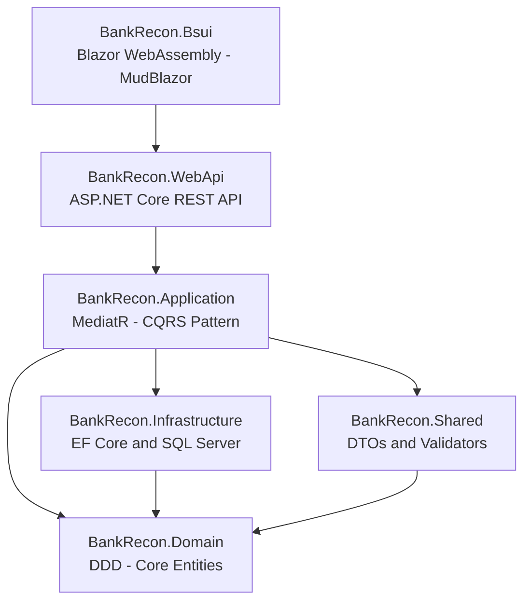

# BankRecon

A modern bank reconciliation application built with **Clean Architecture** and **Domain-Driven Design (DDD)** principles using .NET 8, Blazor WebAssembly, and Entity Framework Core.

## 📋 Overview

BankRecon is a comprehensive solution for bank account reconciliation, enabling users to:

- Manage multiple bank accounts
- Track financial transactions
- Reconcile bank statements with ledger records
- Maintain complete audit trails with soft delete capabilities
- Access data through a responsive Blazor WebAssembly UI

## 🏗️ Architecture

The project follows **Clean Architecture** principles with clear separation of concerns:



### Layers Description

| Layer | Project | Responsibility |
|-------|---------|----------------|
| **UI** | `BankRecon.Bsui` | Blazor WebAssembly frontend with MudBlazor components |
| **API** | `BankRecon.WebApi` | REST endpoints, middleware, configuration |
| **Application** | `BankRecon.Application` | ✅ MediatR CQRS handlers, validators, DTOs, AutoMapper |
| **Domain** | `BankRecon.Domain` | Core business entities, DDD concepts, no dependencies |
| **Shared** | `BankRecon.Shared` | ✅ DTOs, validation rules, utilities |
| **Infrastructure** | `BankRecon.Infrastructure` | ✅ EF Core, repositories, DB config, DI setup |

## 🚀 Tech Stack

| Layer | Technology |
|---|---|
| **Frontend** | Blazor WebAssembly, MudBlazor 7.x |
| **API** | ASP.NET Core 8 Web API, Swagger/OpenAPI |
| **Application** | MediatR 12.x (CQRS), AutoMapper 12.x, FluentValidation 10.x |
| **Domain** | .NET 8 (no external dependencies) |
| **Infrastructure** | Entity Framework Core 8, SQL Server |
| **Shared** | API Response models, Pagination models |

## 📦 Project Structure

```
src/
├── BankRecon.Domain/                  # Domain layer (entities, interfaces)
│   ├── Common/
│   │   ├── BaseEntity.cs              # Base entity with Id, audit fields
│   │   ├── SoftDeletableEntity.cs     # Soft delete support
│   │   └── Interfaces/                # IHasKey, ICreatable, IUpdatable, ISoftDeletable
│   └── Entities/                      # Domain entities
│
├── BankRecon.Application/             # Application layer (CQRS, business logic)
│   ├── Common/
│   │   ├── Behaviors/                 # MediatR pipeline behaviors
│   │   │   ├── LoggingBehavior.cs     # Request/response logging
│   │   │   └── ValidationBehavior.cs  # Automatic FluentValidation
│   │   ├── Exceptions/                # Domain exceptions
│   │   │   ├── EntityNotFoundException.cs
│   │   │   └── ValidationException.cs
│   │   ├── Interfaces/                # IRepository<T>
│   │   └── Mappings/                  # AutoMapper profiles (IMapFrom<T>)
│   ├── Features/                      # Feature-based CQRS organization
│   │   └── {Entity}/
│   │       ├── Commands/              # Create, Update, Delete
│   │       ├── Queries/               # GetAll, GetById
│   │       ├── Dtos/                  # Request/Response DTOs
│   │       └── Validators/            # FluentValidation validators
│   └── DependencyInjection.cs         # Application service registration
│
├── BankRecon.Infrastructure/          # Infrastructure layer (data access)
│   ├── Data/
│   │   └── BankReconDbContext.cs      # EF Core DbContext
│   ├── Configurations/                # EF Core entity configurations
│   ├── Repositories/
│   │   └── Repository.cs              # Generic repository (soft delete aware)
│   └── DependencyInjection.cs         # Infrastructure service registration
│
├── BankRecon.Shared/                  # Shared models (used by API + Blazor)
│   └── Common/
│       ├── Models/
│       │   └── PaginatedList.cs       # Pagination support
│       └── Responses/
│           └── ApiResponse.cs         # Standardized API response wrapper
│
├── BankRecon.WebApi/                  # Web API layer (controllers, middleware)
│   └── Program.cs
│
└── BankRecon.Bsui/                    # Blazor WebAssembly UI
    ├── Pages/
    ├── Shared/
    └── Program.cs
```

## ✨ Key Features

### Infrastructure Layer ✅

- **Generic Repository Pattern** - Reusable data access with soft delete support
- **Soft Delete Capability** - Mark entities as deleted without removing data
- **Audit Trail** - Automatic tracking of CreatedAt, CreatedBy, UpdatedAt, UpdatedBy
- **Query Filters** - Soft-deleted entities automatically excluded from queries
- **Type-Safe Configuration** - EF Core configurations with compile-time safety
- **Flexible Entity Model** - Choose between BaseEntity or AuditableEntity

### Entity Options

```csharp
// Option 1: Basic entity with creation/update tracking
public class BankAccount : BaseEntity { }

// Option 2: Full audit trail with soft delete
public class Transaction : AuditableEntity { }
```

## 🔧 Getting Started

### Prerequisites

- [.NET 8 SDK](https://dotnet.microsoft.com/download/dotnet/8.0)
- [SQL Server](https://www.microsoft.com/sql-server) (LocalDB or full instance)
- [Visual Studio 2022](https://visualstudio.microsoft.com/) (recommended)

### Installation

1. **Clone the repository**
   ```bash
   git clone https://github.com/mikeKharisma28/BankRecon.git
   cd BankRecon
   ```

2. **Configure the database connection**
Update `src/BankRecon.WebApi/appsettings.json`:
   ```json
   {
     "ConnectionStrings": {
       "DefaultConnection": "Server=(localdb)\\mssqllocaldb;Database=BankRecon;Trusted_Connection=True;"
     }
   }
   ```

3. **Run both projects**
Use the multi-project launch profile (`BankRecon.slnLaunch`) or configure in Visual Studio:
- **WebApi**: `https://localhost:57134`
- **Blazor UI**: `https://localhost:57123`

## 📚 Development Workflow

### Creating a New Feature

1. **Define the domain entity** (in `BankRecon.Domain`)

 ```csharp
 public class MyEntity : AuditableEntity
 {
     public string Name { get; set; } = string.Empty;
 }
 ```

2. **Create entity configuration** (in `BankRecon.Infrastructure`)

 ```csharp
 public class MyEntityConfiguration : AuditableEntityConfiguration<MyEntity>
 {
     public override void Configure(EntityTypeBuilder<MyEntity> builder)
     {
         base.Configure(builder);
         builder.ToTable("MyEntities");
         // Configure properties, indexes, relationships
     }
 }
 ```

3. **Create DTOs and validators** (in `BankRecon.Application`)
4. **Create MediatR handlers** (Commands/Queries)
5. **Create API controller** (in `BankRecon.WebApi`)
6. **Create Blazor pages** (in `BankRecon.Bsui`)

## 🎯 Implementation Status

### ✅ Completed

- ✅ Infrastructure Layer (DbContext, Repository, Configurations, DI)
- ✅ Domain Layer (BaseEntity, AuditableEntity, interfaces)

### 🔄 In Progress

- 🔲 Application Layer (MediatR setup, handlers, DTOs, validators)
- 🔲 WebApi Layer (Controllers, middleware, endpoints)
- 🔲 Blazor UI Layer (Pages, components, services)

### 📋 Planned

- 🔲 Authentication and Authorization
- 🔲 Unit and Integration Tests
- 🔲 Logging (Serilog)
- 🔲 Performance optimization

For detailed implementation checklist, see [CONTRIBUTING.md](CONTRIBUTING.md).

## 🔐 Code Standards

This project enforces strict code standards via `.editorconfig`:

- **Indentation:** 4 spaces
- **Line endings:** CRLF (Windows)
- **Character encoding:** UTF-8
- **Naming conventions:** PascalCase (types), camelCase (locals)
- **Namespaces:** File-scoped
- **Null safety:** Nullable reference types enabled

## 📖 Learning Resources

- [Clean Architecture by Uncle Bob](https://blog.cleancoder.com/uncle-bob/2012/08/13/the-clean-architecture.html)
- [Domain-Driven Design](https://www.domainlanguage.com/ddd/)
- [MediatR - CQRS Pattern](https://github.com/jbogard/MediatR)
- [Entity Framework Core Docs](https://docs.microsoft.com/en-us/ef/core/)
- [Blazor Documentation](https://docs.microsoft.com/en-us/aspnet/core/blazor/)
- [MudBlazor Components](https://mudblazor.com/)

## 📝 License

This project is licensed under the **MIT License** - see the [LICENSE](LICENSE) file for details.

## 👨‍💻 Author

**Michael Laksa Kharisma** - [@mikeKharisma28](https://github.com/mikeKharisma28)

## 🤝 Contributing

Contributions are welcome! Please see [CONTRIBUTING.md](CONTRIBUTING.md) for:

- Development guidelines
- Code style requirements
- Feature request process

## 📞 Support

For issues, questions, or suggestions:

- 📌 [Open an Issue](https://github.com/mikeKharisma28/BankRecon/issues)
- 💬 Start a Discussion
- 📧 Contact the maintainers

---

**Status:** 🚧 Under Development | **Current Phase:** Infrastructure Complete (Phase 1/4) | **Last Updated:** April 2026
