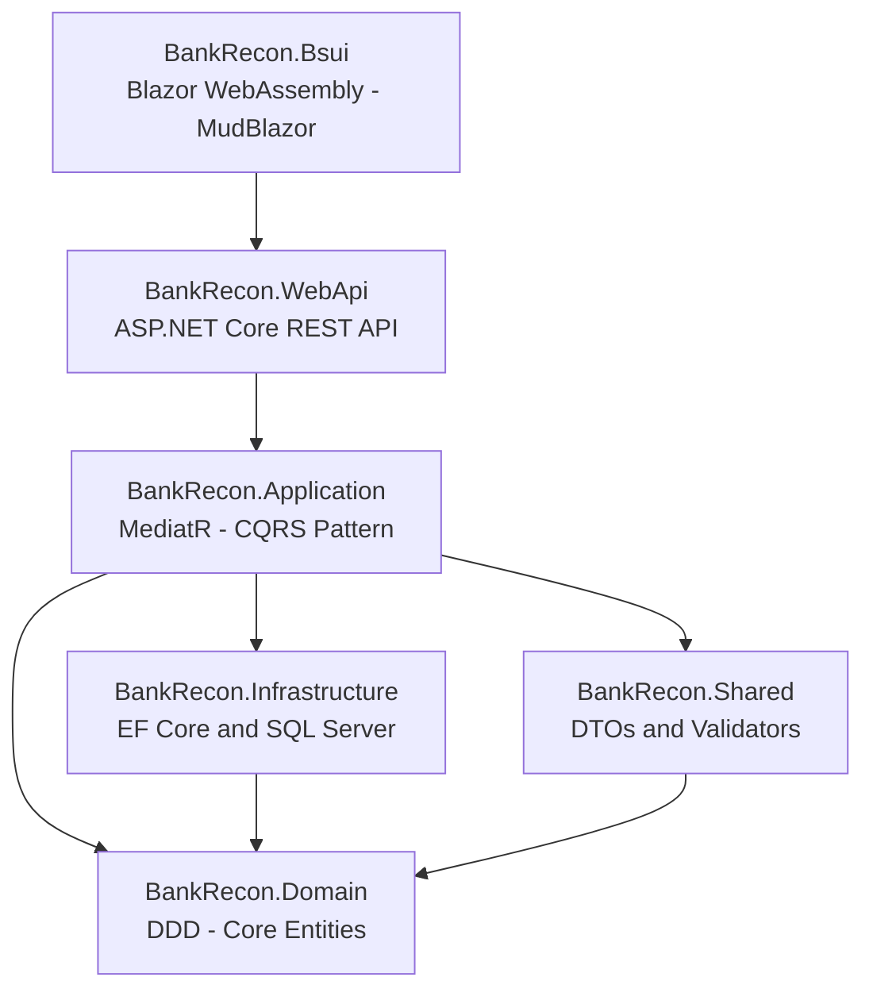

# BankRecon

A modern banking reconciliation application built with **Clean Architecture**, **Domain-Driven Design (DDD)**, and **CQRS** patterns using .NET 8, ASP.NET Core WebAPI, Blazor WebAssembly, and SQL Server.

## 🎯 Project Overview

BankRecon is designed to streamline bank transaction reconciliation with a focus on clean code architecture, maintainability, and scalability. The application separates concerns across multiple layers ensuring testability and flexibility.

### Key Features

- ✅ **Clean Architecture** — Well-defined layers (Domain, Application, Infrastructure, Shared, WebAPI)
- ✅ **CQRS Pattern** — Command/Query separation with MediatR
- ✅ **Domain-Driven Design** — Rich domain entities with business logic
- ✅ **Soft Delete** — Support for logical deletion with restore capability
- ✅ **Audit Trail** — Automatic tracking of creation and update timestamps
- ✅ **Validation** — FluentValidation with MediatR pipeline integration
- ✅ **Exception Handling** — Centralized middleware for error responses
- ✅ **Blazor WebAssembly** — Real-time UI with offline capabilities
- ✅ **API Documentation** — Swagger/OpenAPI integration

## 🏗️ Architecture

The project follows **Clean Architecture** principles with clear separation of concerns:



### Layers Description

| Layer | Project | Responsibility |
|-------|---------|----------------|
| **UI** | `BankRecon.Bsui` | 🔄 Blazor WebAssembly frontend with MudBlazor components |
| **API** | `BankRecon.WebApi` | ✅ REST endpoints, middleware, configuration |
| **Application** | `BankRecon.Application` | ✅ MediatR CQRS handlers, validators, DTOs, AutoMapper |
| **Domain** | `BankRecon.Domain` | ✅ Core business entities, DDD concepts, no dependencies |
| **Shared** | `BankRecon.Shared` | ✅ DTOs, validation rules, utilities |
| **Infrastructure** | `BankRecon.Infrastructure` | ✅ EF Core, repositories, DB config, DI setup |

## 🚀 Tech Stack

| Layer | Technology |
|---|---|
| **Frontend** | Blazor WebAssembly, MudBlazor 7.x |
| **API** | ASP.NET Core 8 Web API, Swagger/OpenAPI |
| **Application** | MediatR 12.x (CQRS), AutoMapper 12.x, FluentValidation 10.x |
| **Domain** | .NET 8 (no external dependencies) |
| **Infrastructure** | Entity Framework Core 8, SQL Server |
| **Shared** | API Response models, Pagination models |

## 📦 Project Structure

```
src/
├── BankRecon.Domain/                  # Domain layer (entities, interfaces)
│   ├── Common/
│   │   ├── BaseEntity.cs              # Base entity with Id, audit fields
│   │   ├── SoftDeletableEntity.cs     # Soft delete support
│   │   └── Interfaces/                # IHasKey, ICreatable, IUpdatable, ISoftDeletable
│   └── Entities/                      # Domain entities
│       └── ExampleSoftDeletableEntity.cs
│
├── BankRecon.Application/             # Application layer (CQRS, business logic)
│   ├── Common/
│   │   ├── Behaviors/                 # MediatR pipeline behaviors
│   │   │   ├── LoggingBehavior.cs     # Request/response logging
│   │   │   └── ValidationBehavior.cs  # Automatic FluentValidation
│   │   ├── Exceptions/                # Domain exceptions
│   │   │   ├── EntityNotFoundException.cs
│   │   │   └── ValidationException.cs
│   │   ├── Interfaces/                # IRepository<T>
│   │   └── Mappings/                  # AutoMapper profiles (IMapFrom<T>)
│   ├── Features/                      # Feature-based CQRS organization
│   │   └── ExampleSoftDeletableEntities/
│   │       ├── Commands/              # Create, Update, Delete
│   │       ├── Queries/               # GetAll, GetById
│   │       └── Validators/            # FluentValidation validators
│   └── DependencyInjection.cs         # Application service registration
│
├── BankRecon.Infrastructure/          # Infrastructure layer (data access)
│   ├── Data/
│   │   └── BankReconDbContext.cs      # EF Core DbContext
│   ├── Repositories/
│   │   └── Repository.cs              # Generic repository (soft delete aware)
│   ├── EntityConfigurations/
│   └── DependencyInjection.cs         # Infrastructure service registration
│
├── BankRecon.Shared/                  # Shared models (used by API + Blazor)
│   ├── Common/
│   │   ├── Responses/
│   │   │   └── ApiResponse.cs         # Standardized API response wrapper
│   │   ├── Models/
│   │   │   └── PaginatedList.cs       # Pagination support
│   │   └── Mappings/
│   │       └── IMapFrom.cs
│   └── Features/
│       └── ExampleSoftDeletableEntities/
│           └── Dtos/
│
├── BankRecon.WebApi/                  # Web API layer (controllers, middleware)
│   ├── Controllers/
│   ├── Middleware/
│   ├── Properties/
│   ├── Program.cs
│   ├── appsettings.json
│   └── appsettings.Development.json
│
└── BankRecon.Bsui/                    # Blazor WebAssembly UI
    ├── Pages/
    ├── Shared/
    └── Program.cs
```

## ✨ Key Features

### Infrastructure Layer ✅

- **Generic Repository Pattern** - Reusable data access with soft delete support
- **Soft Delete Capability** - Mark entities as deleted without removing data
- **Audit Trail** - Automatic tracking of CreatedAt, CreatedBy, UpdatedAt, UpdatedBy
- **Query Filters** - Soft-deleted entities automatically excluded from queries
- **Type-Safe Configuration** - EF Core configurations with compile-time safety
- **Flexible Entity Model** - Choose between BaseEntity or AuditableEntity

### Entity Options

```csharp
// Option 1: Basic entity with creation/update tracking
public class BankAccount : BaseEntity { }

// Option 2: Full audit trail with soft delete
public class Transaction : AuditableEntity { }
```

## 🔧 Getting Started

### Prerequisites

- **.NET 8 SDK** — [Download](https://dotnet.microsoft.com/download)
- **SQL Server** or **LocalDB** — Included with Visual Studio
- **Visual Studio 2022** or **VS Code** with C# extension

### Setup Instructions

1. **Clone the repository**
   ```bash
   git clone https://github.com/mikeKharisma28/BankRecon.git
   cd BankRecon
   ```

2. **Restore NuGet packages**
   ```bash
   dotnet restore
   ```

3. **Update the database**
   ```bash
   dotnet ef database update --project src/BankRecon.Infrastructure --startup-project src/BankRecon.WebApi
   ```

4. **Run the WebAPI**
   ```bash
   dotnet run --project src/BankRecon.WebApi
   ```

5. **Access Swagger UI**
- Navigate to `https://localhost:5001/swagger` (or the port shown in console)
- Explore and test all API endpoints

## 📚 Development Workflow

### Creating a New Feature

1. **Define the domain entity** (in `BankRecon.Domain`)

 ```csharp
 public class MyEntity : AuditableEntity
 {
     public string Name { get; set; } = string.Empty;
 }
 ```

2. **Create entity configuration** (in `BankRecon.Infrastructure`)

 ```csharp
 public class MyEntityConfiguration : AuditableEntityConfiguration<MyEntity>
 {
     public override void Configure(EntityTypeBuilder<MyEntity> builder)
     {
         base.Configure(builder);
         builder.ToTable("MyEntities");
         // Configure properties, indexes, relationships
     }
 }
 ```

3. **Create DTOs and validators** (in `BankRecon.Application`)
4. **Create MediatR handlers** (Commands/Queries)
5. **Create API controller** (in `BankRecon.WebApi`)
6. **Create Blazor pages** (in `BankRecon.Bsui`)

## 🎯 Implementation Status

### ✅ Completed

- ✅ Domain Layer (BaseEntity, SoftDeletableEntity, interfaces)
- ✅ Shared Layer (ApiResponse, PaginatedList, IMapFrom, DTOs)
- ✅ Application Layer (MediatR CQRS, FluentValidation, AutoMapper, pipeline behaviors)
- ✅ Infrastructure Layer (DbContext, generic repository, EF configs, soft delete filters)
- ✅ WebApi Layer (controllers, ExceptionHandlingMiddleware, Swagger, CORS)

### 🔄 In Progress

- 🔄 Blazor UI Layer — `BankRecon.Bsui` (project scaffolded, MudBlazor integrated, feature pages pending)

### 📋 Planned

- 🔲 Authentication and Authorization
- 🔲 Unit and Integration Tests
- 🔲 Logging (Serilog)
- 🔲 Performance optimization

For detailed implementation checklist, see [CONTRIBUTING.md](CONTRIBUTING.md).

---

**Status:** 🚧 Under Development | **Current Phase:** WebApi Complete — Blazor UI In Progress (Phase 3/4) | **Last Updated:** April 2026

## 🔐 Code Standards

This project enforces strict code standards via `.editorconfig`:

- **Indentation:** 4 spaces
- **Line endings:** CRLF (Windows)
- **Character encoding:** UTF-8
- **Naming conventions:** PascalCase (types), camelCase (locals)
- **Namespaces:** File-scoped
- **Null safety:** Nullable reference types enabled

## 📖 Learning Resources

- [Clean Architecture by Uncle Bob](https://blog.cleancoder.com/uncle-bob/2012/08/13/the-clean-architecture.html)
- [Domain-Driven Design](https://www.domainlanguage.com/ddd/)
- [MediatR - CQRS Pattern](https://github.com/jbogard/MediatR)
- [Entity Framework Core Docs](https://docs.microsoft.com/en-us/ef/core/)
- [Blazor Documentation](https://docs.microsoft.com/en-us/aspnet/core/blazor/)
- [MudBlazor Components](https://mudblazor.com/)

## 🧪 Testing

### Running Tests

# Run all tests
dotnet test

# Run tests with coverage
dotnet test /p:CollectCoverage=true

## 📖 API Documentation

### Example Endpoints

#### Get All Entities
GET /api/examplesoftdeletableentities
Content-Type: application/json

Response:
```json
{
  "isSuccess": true,
  "message": "Success",
  "result": [
    {
      "id": "guid",
      "description": "Example description",
      "amount": 100.00,
      "createdAt": "2024-04-04T10:00:00Z",
      "updatedAt": null
    }
  ],
  "errors": null
}
```

#### Create Entity
POST /api/examplesoftdeletableentities
Content-Type: application/json

Request:
```json
{
  "description": "New transaction",
  "amount": 250.50
}
```

Response:
```json
{
  "isSuccess": true,
  "message": "Entity created successfully.",
  "result": {
    "id": "new-guid",
    "description": "New transaction",
    "amount": 250.50,
    "createdAt": "2024-04-04T10:15:00Z",
    "updatedAt": null
  }
}
```

## 🤝 Contributing

Contributions are welcome! Please see [CONTRIBUTING.md](CONTRIBUTING.md) for:

- Development guidelines
- Code style requirements
- Feature request process

## 📄 License

This project is licensed under the MIT License — see the LICENSE file for details.

## 👤 Author

**Michael Laksa Kharisma** — [@mikeKharisma28](https://github.com/mikeKharisma28)

## 📞 Support

For issues, questions, or suggestions, please open an [issue](https://github.com/mikeKharisma28/BankRecon/issues) on GitHub.

---

**Status:** 🚧 Under Development | **Current Phase:** WebApi Complete — Blazor UI In Progress (Phase 3/4) | **Last Updated:** April 2026
