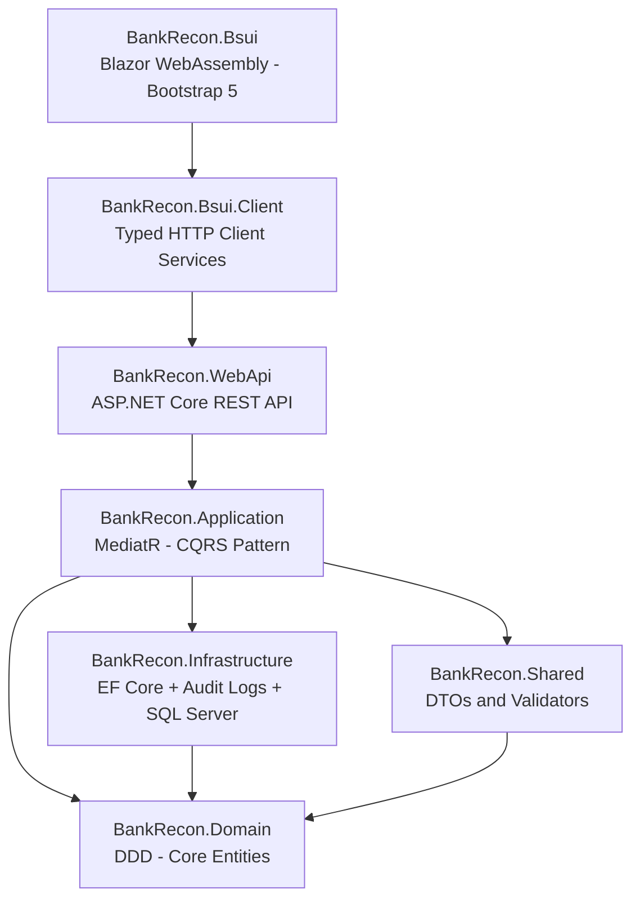

# BankRecon

A modern banking reconciliation application built with **Clean Architecture**, **Domain-Driven Design (DDD)**, and **CQRS** patterns using .NET 8, ASP.NET Core WebAPI, Blazor WebAssembly, and SQL Server.

## 🎯 Project Overview

BankRecon is designed to streamline bank transaction reconciliation with a focus on clean code architecture, maintainability, and scalability. The application separates concerns across multiple layers ensuring testability and flexibility.

### Key Features

- ✅ **Clean Architecture** — Well-defined layers (Domain, Application, Infrastructure, Shared, WebAPI)
- ✅ **CQRS Pattern** — Command/Query separation with MediatR
- ✅ **Domain-Driven Design** — Rich domain entities with business logic
- ✅ **Soft Delete** — Support for logical deletion with restore capability
- ✅ **Audit Trail** — Automatic tracking of all create, update, delete operations with old/new values
- ✅ **Audit Log Entity** — `AuditLog` table stores complete change history with affected columns
- ✅ **Validation** — FluentValidation with MediatR pipeline integration
- ✅ **Exception Handling** — Centralized middleware for error responses
- ✅ **Blazor WebAssembly** — Real-time UI with offline capabilities
- ✅ **API Documentation** — Swagger/OpenAPI integration
- ✅ **Bootstrap 5 UI** — Lightweight, responsive components without external UI libraries
- ✅ **Reusable Components** — Generic DataTable and form components for rapid feature development

## 🏗️ Architecture

The project follows **Clean Architecture** principles with clear separation of concerns:



### Layers Description

| Layer | Project | Responsibility |
|-------|---------|----------------|
| **UI** | `BankRecon.Bsui` | ✅ Blazor WebAssembly frontend with Bootstrap 5 components |
| **Client** | `BankRecon.Bsui.Client` | ✅ Typed HTTP client services, API communication layer |
| **API** | `BankRecon.WebApi` | ✅ REST endpoints, middleware, configuration |
| **Application** | `BankRecon.Application` | ✅ MediatR CQRS handlers, validators, DTOs, AutoMapper |
| **Domain** | `BankRecon.Domain` | ✅ Core business entities, DDD concepts, no dependencies |
| **Shared** | `BankRecon.Shared` | ✅ DTOs, validation rules, utilities |
| **Infrastructure** | `BankRecon.Infrastructure` | ✅ EF Core, repositories, audit logs, DB config, DI setup |

## 🚀 Tech Stack

| Layer | Technology |
|---|---|
| **Frontend** | Blazor WebAssembly, Bootstrap 5, Bootstrap Icons |
| **Client** | Typed HttpClient, Microsoft.Extensions.Http |
| **API** | ASP.NET Core 8 Web API, Swagger/OpenAPI |
| **Application** | MediatR 12.x (CQRS), AutoMapper 16.x, FluentValidation 10.x |
| **Domain** | .NET 8 (no external dependencies) |
| **Infrastructure** | Entity Framework Core 8, SQL Server, Audit Log Tracking |
| **Shared** | API Response models, Pagination models |

## 📦 Project Structure

```
src/
├── BankRecon.Domain/                      # Domain layer (entities, interfaces)
│   ├── Common/                            
│   │   ├── BaseEntity.cs                  # Base entity with Id, audit fields
│   │   ├── SoftDeletableEntity.cs         # Soft delete support
│   │   └── Interfaces/                    # IHasKey, ICreatable, IUpdatable, ISoftDeletable
│   ├── Entities/                          
│   │   └── AuditLog.cs                    # Audit log entity
│                                          
├── BankRecon.Application/                 # Application layer (CQRS, business logic)
│   ├── Common/                            
│   │   ├── Behaviors/                     # MediatR pipeline behaviors
│   │   │   ├── LoggingBehavior.cs         # Request/response logging
│   │   │   └── ValidationBehavior.cs      # Automatic FluentValidation
│   │   ├── Exceptions/                    # Domain exceptions
│   │   │   ├── EntityNotFoundException.cs
│   │   │   └── ValidationException.cs
│   │   ├── Interfaces/                    # IRepository<T>
│   │   └── Mappings/                      # AutoMapper profiles (IMapFrom<T>)
│   ├── Features/                          # Feature-based CQRS organization
│   │   └── ExampleSoftDeletableEntities/
│   │       ├── Commands/                  # Create, Update, Delete
│   │       ├── Queries/                   # GetAll, GetById
│   │       └── Validators/                # FluentValidation validators
│   └── DependencyInjection.cs             # Application service registration
│
├── BankRecon.Infrastructure/              # Infrastructure layer (data access)
│   ├── Data/                              
│   │   └── BankReconDbContext.cs          # EF Core DbContext with audit tracking
│   ├── Repositories/
│   │   └── Repository.cs                  # Generic repository (soft delete aware)
│   ├── Configurations/
│   │   ├── BaseEntityConfiguration.cs
│   │   ├── SoftDeletableEntityConfiguration.cs
│   │   └── AuditLogConfiguration.cs
│   └── DependencyInjection.cs             # Infrastructure service registration
│
├── BankRecon.Shared/                      # Shared models (used by API + Blazor)
│   ├── Common/
│   │   ├── Responses/
│   │   │   └── ApiResponse.cs             # Standardized API response wrapper
│   │   ├── Models/
│   │   │   └── PaginatedList.cs           # Pagination support
│   │   └── Mappings/
│   │       └── IMapFrom.cs
│   └── Features/
│       └── ExampleSoftDeletableEntities/
│           └── Dtos/
│
├── BankRecon.WebApi/                      # Web API layer (controllers, middleware)
│   ├── Controllers/
│   ├── Middleware/
│   ├── Properties/
│   ├── Program.cs
│   ├── appsettings.json
│   └── appsettings.Development.json
│
├── BankRecon.Bsui.Client/                 # Blazor client layer (HTTP services)
│   ├── Common/
│   │   ├── Interfaces/
│   │   │   └── IApiClient.cs              # Base HTTP client contract
│   │   └── Services/
│   │       └── ApiClient.cs               # Base HTTP client implementation
│   ├── Features/
│   │   ├── Interfaces/
│   │   │   └── IAuditLogService.cs        # Feature-specific interface
│   │   └── Services/
│   │       └── AuditLogService.cs         # Feature-specific implementation
│   └── DependencyInjection.cs             # Bsui.Client service registration
│
└── BankRecon.Bsui/                        # Blazor WebAssembly UI
    ├── Common/
    │   ├── Components/
    │   │   └── DataTable/
    │   │       ├── DataTable.razor        # Generic reusable data table component
    │   │       └── DataTableColumn.cs     # Column definition class
    │   └── Layout/
    │       ├── MainLayout.razor           # Main application layout
    │       ├── MainLayout.razor.css
    │       ├── NavMenu.razor              # Navigation menu with Bootstrap Icons
    │       └── NavMenu.razor.css
    ├── Features/
    │   ├── Home.razor                     # Home / dashboard page
    │   └── AuditLogs/
    │       ├── Index.razor                # Audit log list with DataTable
    │       ├── Detail.razor               # Audit log detail view
    │       └── Components/
    │           └── AuditLogsTable.razor   # Feature-specific table wrapper
    ├── Pages/
    │   ├── Weather.razor                  # Demo page using DataTable
    │   └── ...
    ├── wwwroot/
    │   ├── bootstrap/
    │   │   └── bootstrap.min.css
    │   └── app.css
    ├── App.razor
    ├── Routes.razor
    ├── _Imports.razor
    └── Program.cs
```

## ✨ Key Features

### Infrastructure Layer ✅

- **Generic Repository Pattern** - Reusable data access with soft delete support
- **Soft Delete Capability** - Mark entities as deleted without removing data
- **Comprehensive Audit Trail** - Automatic tracking of all CRUD operations
- **Query Filters** - Soft-deleted entities automatically excluded from queries
- **Type-Safe Configuration** - EF Core configurations with compile-time safety
- **Flexible Entity Model** - Choose between BaseEntity or SoftDeletableEntity
- **Audit Log Entity** - `AuditLog` table for complete change history

### API Client Layer ✅

- **Base API Client** - Reusable `IApiClient` abstraction for all HTTP operations
- **Typed Services** - Feature-specific services (e.g., `IAuditLogService`)
- **Automatic Deserialization** - Built-in `ApiResponse<T>` handling
- **Typed HttpClient** - Uses `IHttpClientFactory` for efficient resource management
- **Dependency Injection** - Clean DI integration via `AddBsuiClient()` extension

### Blazor WebAssembly UI ✅

- **Bootstrap 5 Components** — Lightweight, responsive UI without external libraries
- **Reusable DataTable Component** — Generic, sortable table for any data type
- **Audit Log Viewer** — List page with sorting, action badges, loading skeleton
- **Audit Log Detail** — Detail page with formatted JSON old/new values display
- **Home Page** — Dashboard landing page
- **Navigation Menu** — Bootstrap Icons with proper alignment

### Audit & Soft Delete System ✅

#### Soft Delete

- Data is never permanently removed; instead marked as deleted
- Automatic query filtering excludes deleted records
- Full restore capability available

#### Audit Logging

Every operation is automatically logged with:

- **Action Type** — Create, Update, or Delete
- **Old Values** — Previous state (JSON serialized)
- **New Values** — Current state (JSON serialized)
- **Affected Columns** — Which fields were modified (for updates)
- **Timestamp** — When the action occurred
- **PerformedBy** — Who performed the action (optional, requires user identity configuration)

**Example Audit Entry:**
```json
{
  "EntityName": "ExampleSoftDeletableEntity",
  "EntityId": "550e8400-e29b-41d4-a716-446655440000",
  "Action": "Update",
  "OldValues": { "Description": "Test", "Amount": 100.00 },
  "NewValues": { "Description": "Updated", "Amount": 150.00 },
  "AffectedColumns": "Description, Amount",
  "Timestamp": "2026-04-04T10:15:00Z",
  "PerformedBy": "john.doe@example.com"
}
```

### Entity Options

```csharp
// Option 1: Basic entity with creation/update tracking
public class BankAccount : BaseEntity { }

// Option 2: Full audit trail with soft delete
public class Transaction : SoftDeletableEntity { }
```

## 🔧 Getting Started

### Prerequisites

- **.NET 8 SDK** — [Download](https://dotnet.microsoft.com/download)
- **SQL Server** or **LocalDB** — Included with Visual Studio
- **Visual Studio 2022** or **VS Code** with C# extension

### Setup Instructions

1. **Clone the repository**
   ```bash
   git clone https://github.com/mikeKharisma28/BankRecon.git
   cd BankRecon
   ```

2. **Restore NuGet packages**
   ```bash
   dotnet restore
   ```

3. **Update the database**
   ```bash
   dotnet ef database update --project src/BankRecon.Infrastructure --startup-project src/BankRecon.WebApi
   ```

4. **Run the WebAPI**
   ```bash
   dotnet run --project src/BankRecon.WebApi
   ```

5. **Access Swagger UI**
- Navigate to `https://localhost:5001/swagger` (or the port shown in console)
- Explore and test all API endpoints

## 📚 Development Workflow

### Creating a New Feature

1. **Define the domain entity** (in `BankRecon.Domain`)

 ```csharp
 public class MyEntity : SoftDeletableEntity
 {
     public string Name { get; set; } = string.Empty;
 }
 ```

2. **Create entity configuration** (in `BankRecon.Infrastructure`)

 ```csharp
 public class MyEntityConfiguration : SoftDeletableEntityConfiguration<MyEntity>
 {
     public override void Configure(EntityTypeBuilder<MyEntity> builder)
     {
         base.Configure(builder);
         builder.ToTable("MyEntities");
         // Configure properties, indexes, relationships
     }
 }
 ```

3. **Create DTOs and validators** (in `BankRecon.Application`)
4. **Create MediatR handlers** (Commands/Queries)
5. **Create API controller** (in `BankRecon.WebApi`)
6. **Create client service** (in `BankRecon.Bsui.Client`)
7. **Create Blazor pages** (in `BankRecon.Bsui`)

### How Audit Logging Works (Automatic)

✅ **No manual coding required!** The system automatically:

1. Intercepts all database changes via `DbContext.SaveChangesAsync()` override
2. Captures old and new values for each modified entity
3. Serializes changes to JSON format
4. Records in the `AuditLog` table with timestamp and user info

**All you do is use the repository normally:**
// Create — Automatically logged
await repository.AddAsync(entity);

// Update — Automatically logged (old/new values captured)
await repository.UpdateAsync(entity);

// Delete — Automatically logged as soft delete
await repository.DeleteAsync(id);

// Restore — Automatically logged
await repository.RestoreAsync(id);

## 🎯 Implementation Status

### ✅ Phase 1: Core Architecture & Application Layer (COMPLETED)

- ✅ Domain Layer (BaseEntity, SoftDeletableEntity, interfaces)
- ✅ Application Layer (MediatR CQRS, FluentValidation, AutoMapper, pipeline behaviors)
- ✅ Infrastructure Layer (DbContext, generic repository, EF configs, soft delete filters)
- ✅ Infrastructure Layer (Audit Log System with automatic change tracking)
- ✅ Shared Layer (ApiResponse, PaginatedList, IMapFrom, DTOs)

### ✅ Phase 2: WebApi Layer (COMPLETED)

- ✅ WebApi Layer (controllers, ExceptionHandlingMiddleware, Swagger, CORS)
- ✅ AuditLog endpoints and queries
- ✅ Configuration and middleware setup

### ✅ Phase 3: Blazor WebAssembly Client (COMPLETED)

- ✅ Bsui.Client Layer (typed HTTP client services, API communication)
- ✅ Base API client (IApiClient, ApiClient)
- ✅ Feature-specific services (IAuditLogService, AuditLogService)
- ✅ Blazor WebAssembly project (Bootstrap 5 integration, DI setup)

### ✅ Phase 4: Bsui Foundation & Audit Log UI (COMPLETED)

- ✅ Bsui Foundation (index.html, App.razor, MainLayout.razor, Program.cs, _Imports.razor)
- ✅ Home page (dashboard landing)
- ✅ Audit Log list page (DataTable, action badges, loading skeleton)
- ✅ Audit Log detail page (formatted JSON old/new values)
- ✅ Navigation menu with Bootstrap Icons and proper alignment

### 🚀 Phase 5: Reusable Components & Remaining UI Features (IN PROGRESS)

#### Reusable Components Library ✅ (Started)
- ✅ **Generic DataTable Component** — Dynamic, sortable table for any data type
  - Support for dynamic columns and data binding
  - Built-in action buttons customization
  - Responsive design
  - Sorting capabilities
- [ ] **Generic Form Component** — Reusable form with validation
- [ ] **Modal Dialog Component** — For confirmations and dialogs
- [ ] **Notification Components** — Toast/alert system

#### Entity Management Pages
- [ ] Entity list pages with DataTable component
- [ ] Entity detail pages
- [ ] Create/Edit form pages with validation
- [ ] Delete confirmation dialogs

#### Advanced Features
- [ ] Client-side form validation with visual feedback
- [ ] Global state management (if needed)
- [ ] Error handling UI components
- [ ] Authentication and Authorization (JWT)
- [ ] Role-based access control (RBAC)
- [ ] Advanced search & filtering
- [ ] Bulk operations
- [ ] Export/Import functionality
- [ ] PerformedBy user identity population
- [ ] Unit & integration tests

---

**Status:** 🚧 Under Development | **Current Phase:** Phase 5 — Reusable Components & Remaining UI Features In Progress | **Last Updated:** April 2026

## 🔐 Code Standards

This project enforces strict code standards via `.editorconfig`:

- **Indentation:** 4 spaces
- **Line endings:** CRLF (Windows)
- **Character encoding:** UTF-8
- **Naming conventions:** PascalCase (types), camelCase (locals)
- **Namespaces:** File-scoped
- **Null safety:** Nullable reference types enabled

## 📖 Learning Resources

- [Clean Architecture by Uncle Bob](https://blog.cleancoder.com/uncle-bob/2012/08/13/the-clean-architecture.html)
- [Domain-Driven Design](https://www.domainlanguage.com/ddd/)
- [MediatR - CQRS Pattern](https://github.com/jbogard/MediatR)
- [Entity Framework Core Docs](https://docs.microsoft.com/en-us/ef/core/)
- [Blazor Documentation](https://docs.microsoft.com/en-us/aspnet/core/blazor/)
- [Bootstrap 5](https://getbootstrap.com/)
- [Bootstrap Icons](https://icons.getbootstrap.com/)

## 🧪 Testing

### Running Tests

# Run all tests
dotnet test

# Run tests with coverage
dotnet test /p:CollectCoverage=true

## 📖 API Documentation

### Example Endpoints

#### Get All Entities
GET /api/examplesoftdeletableentities
Content-Type: application/json

Response:
```json
{
  "isSuccess": true,
  "message": "Success",
  "result": [
    {
      "id": "550e8400-e29b-41d4-a716-446655440000",
      "description": "Example description",
      "amount": 100.00,
      "createdAt": "2026-04-04T10:00:00Z",
      "updatedAt": null
    }
  ],
  "errors": null
}
```

#### Create Entity
POST /api/examplesoftdeletableentities
Content-Type: application/json

Request:
```json
{
  "description": "New transaction",
  "amount": 250.50
}
```

Response:
```json
{
  "isSuccess": true,
  "message": "Entity created successfully.",
  "result": {
    "id": "550e8400-e29b-41d4-a716-446655440000",
    "description": "New transaction",
    "amount": 250.50,
    "createdAt": "2026-04-04T10:15:00Z",
    "updatedAt": null
  }
}
```

#### Update Entity
PUT /api/examplesoftdeletableentities/{id}
Content-Type: application/json

Request:
```json
{
  "description": "Updated description",
  "amount": 300.00
}
```

Response:
```json
{
  "isSuccess": true,
  "message": "Entity updated successfully.",
  "result": {
    "id": "550e8400-e29b-41d4-a716-446655440000",
    "description": "Updated transaction",
    "amount": 300.00,
    "createdAt": "2026-04-04T10:15:00Z",
    "updatedAt": "2026-04-04T10:30:00Z"
  }
}
```

#### Delete Entity (Soft Delete)
DELETE /api/examplesoftdeletableentities/{id}

Response:
```json
{
  "isSuccess": true,
  "message": "Entity deleted successfully."
}
```

> The record is marked as deleted (not permanently removed). To view audit logs of this change, query the `AuditLog` table.

#### Get All Audit Logs
GET /api/auditlogs
Content-Type: application/json

Response:
```json
{
  "isSuccess": true,
  "message": "Success",
  "result": [
    {
      "id": "660e8400-e29b-41d4-a716-446655440001",
      "entityName": "ExampleSoftDeletableEntity",
      "entityId": "550e8400-e29b-41d4-a716-446655440000",
      "action": "Create",
      "oldValues": null,
      "newValues": "{\"Id\":\"550e8400-e29b-41d4-a716-446655440000\",\"Description\":\"Test\",\"Amount\":100}",
      "affectedColumns": null,
      "timestamp": "2026-04-04T10:00:00Z",
      "performedBy": null
    }
  ],
  "errors": null
}
```

## 🤝 Contributing

Contributions are welcome! Please see [CONTRIBUTING.md](CONTRIBUTING.md) for:

- Development guidelines
- Code style requirements
- Feature request process
- Audit system documentation

## 📄 License

This project is licensed under the MIT License — see the LICENSE file for details.

## 👤 Author

**Michael Laksa Kharisma** — [@mikeKharisma28](https://github.com/mikeKharisma28)

## 📞 Support

For issues, questions, or suggestions, please open an [issue](https://github.com/mikeKharisma28/BankRecon/issues) on GitHub.

---

**Status:** 🚧 Under Development | **Current Phase:** Phase 5 — Reusable Components & Remaining UI Features In Progress | **Last Updated:** April 2026
